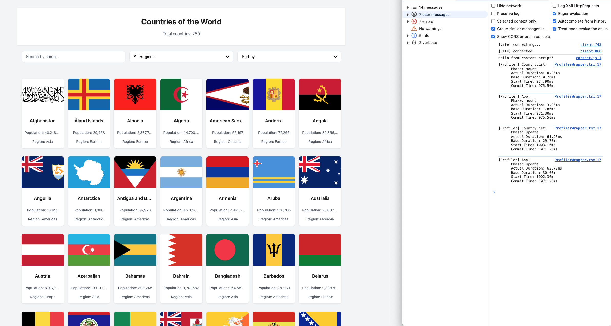
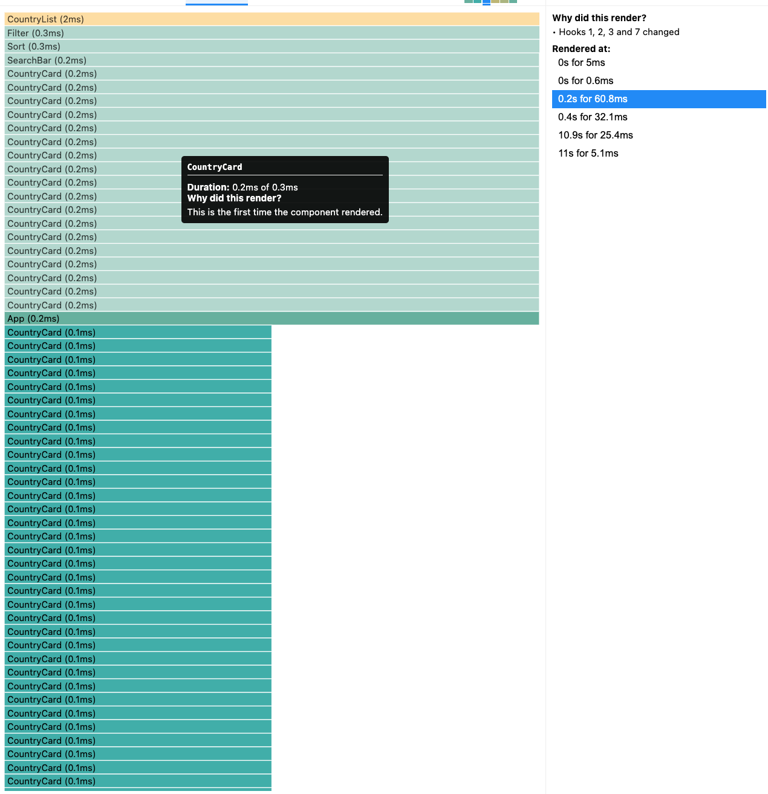
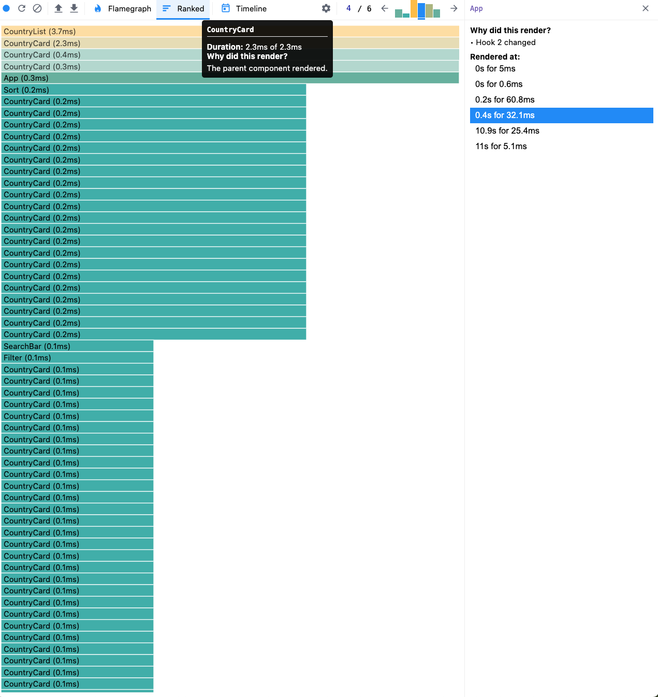
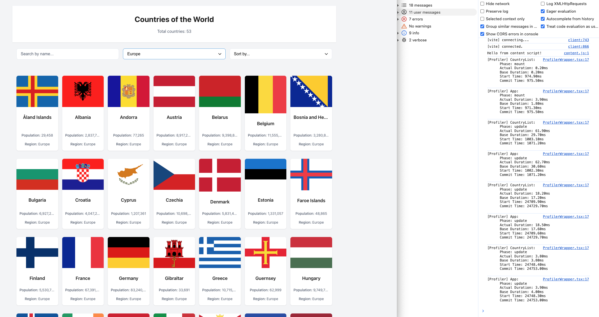
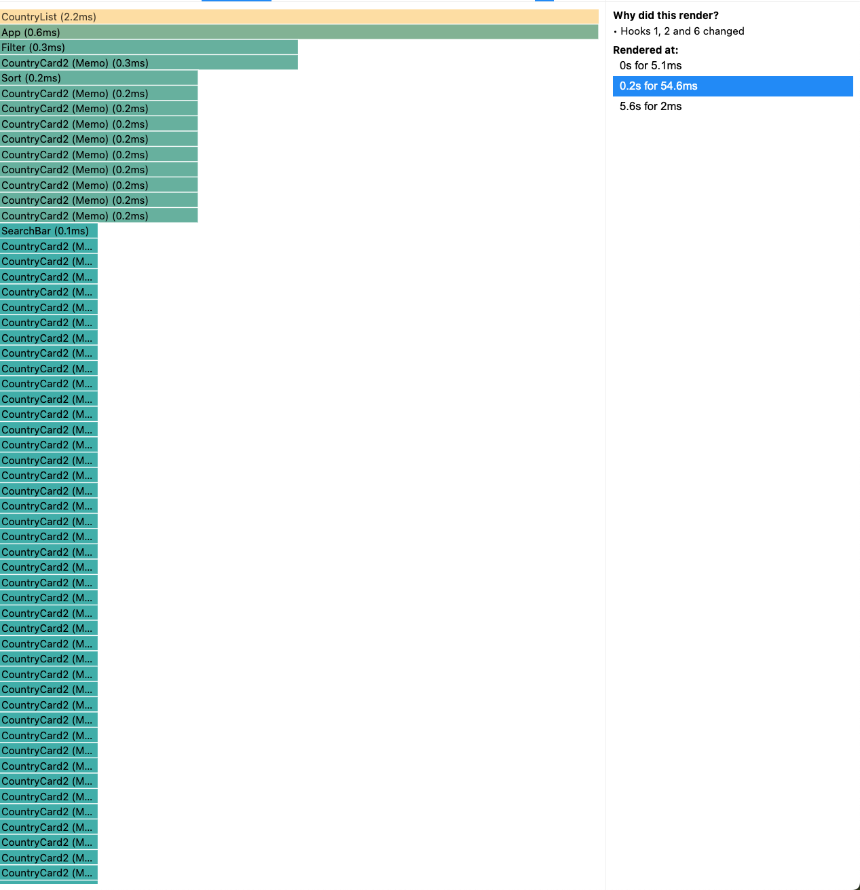
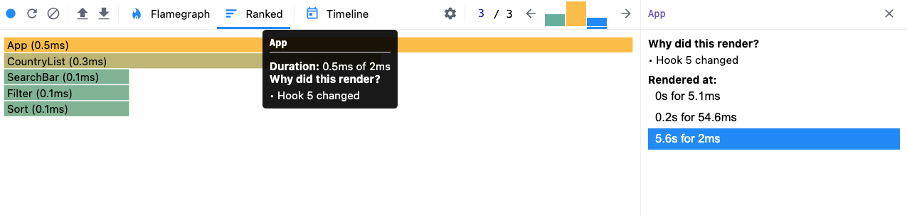
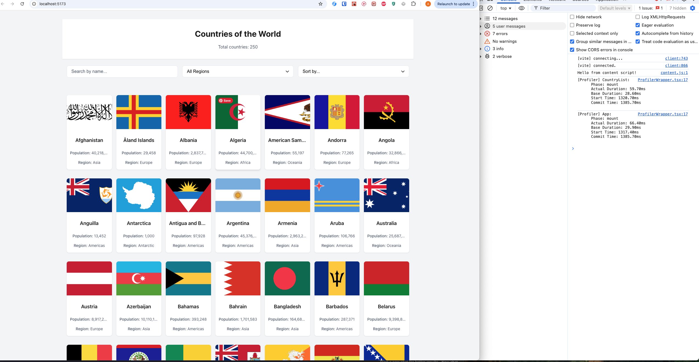
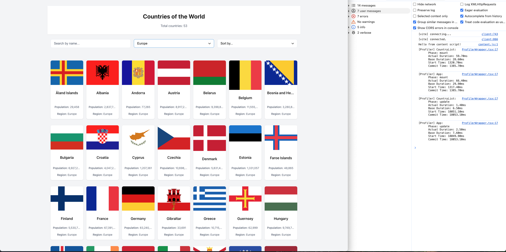

# Application Overview

The Country Explorer app:

- List of countries with their flags and basic information
- Search countries by name
- Filter countries by region
- Sort countries by name or population
- Mark countries as visited

## Performance Analysis

- Both search, region filter and sort functionalities works the same way - we filter out arrray of countries we fetched from API based on changed parameter. Before optiomization we used state and useEffect() to keep track of filtered countries and re-render the list every time. After optimization we switched to useMemo()[search, region, sort] value and use it together with memo() of individual Card components.

### Before Optimization

#### Initial Load

- Commit Duration: ~69ms
- Render Duration: ~63ms
  - App: ~4ms
  - CountryList: ~61ms
  - CountryCard: ~0.1-0.2ms per card
- Total Components: ~250 (including all CountryCards)

#### User Interactions

1. **Filter Operation or Search Operation or SortOperation**
   - Commit Duration: ~19ms
   - Re-renders: All CountryCards
   - Render Duration: ~17 ms

2. **Toggle Visited Status**
   - Re-renders: Only the toggled CountryCard

### After Optimization (with memo, useMemo, useCallback)

#### Initial Load

- Commit Duration: ~68ms
- Render Duration:
  - App: ~66ms
  - CountryList: ~59.7ms
  - CountryCard: ~0.1-0.2ms per card
- Total Components: ~250

#### User Interactions

1. **Filter Operation or Search Operation or SortOperation**
   - Commit Duration: ~4.5ms
   - Re-renders:  Only affected CountryCards
   - Render Duration: ~2.5ms

2. **Toggle Visited Status**
   - Re-renders: Only the toggled CountryCard

## Performance Improvements

1. **Component Memoization**
   - Used `React.memo` for `CountryCard` to prevent unnecessary re-renders
   - Only re-renders when props actually change

2. **Callback Optimization**
   - Implemented `useCallback` for event handlers
   - Prevents recreation of function references on every render.

3. **Computed Values**
   - Used `useMemo` for expensive computations (sort, filter by region, sort by name and population)
   - Caches filtered and sorted results

## Key Findings

1. **Render Optimization**
   - Before: All CountryCards re-rendered on any state change
   - After: Only affected components re-render

2. **Performance Gains**
   - Search, Filter, Sort: ~5 times faster

## Screenshots

### Before Optimization

### After Optimization

## Conclusion

The most significant improvements were seen in:

1. Search, filter and sort operations (5 times faster)
